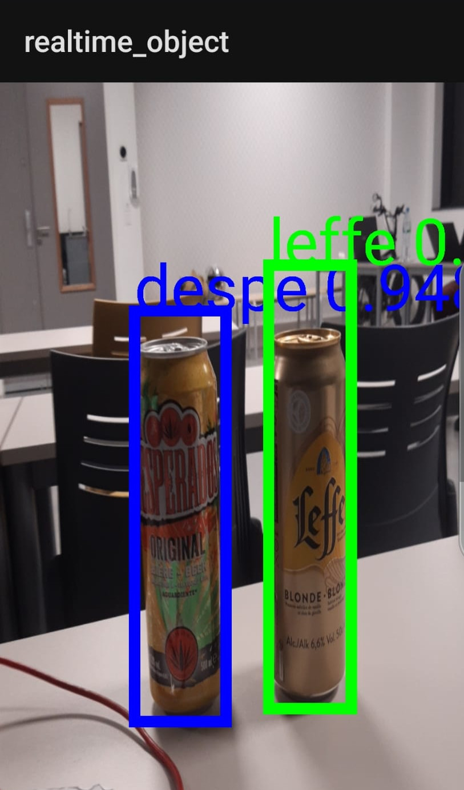

# PFE23-T-17-ClHearWay
Projet de fin d'études - Application d'amélioration expérience achat pour personnes malvoyantes

## Partie Détection d'objet:

L'application que nous avons développé se repose sur une adaptation du code github suivant : https://github.com/Pawandeep-prog/realtime_object_detection

Pour lancer ce projet, ouvrir le dossier "realtime_object_detection" avec un IDE Android (IntelliJ ou Android Studio).

Cette application Android permet d'utiliser la caméra du smartphone pour détecter des objet avec le modèle d'Intelligence Artificielle SSD_Mobilenet_V2.

Le modèle de détection d'objet a été entrainé pour détecter les produits suivants: Bière Leffe et Desperados.
En utilisant le notebook python suivant : < https://colab.research.google.com/github/EdjeElectronics/TensorFlow-Lite-Object-Detection-on-Android-and-Raspberry-Pi/blob/master/Train_TFLite2_Object_Detction_Model.ipynb#scrollTo=5tdDbTmHYwu- >

Le Dataset qui a servi à entrainer l'IA se compose de 180 images de résolution maximale de 1024x1365
Les labels et bounding box ont été renseignéres avec le programme python LabelImg < https://pypi.org/project/labelImg/ >

Résultat de l'application :

